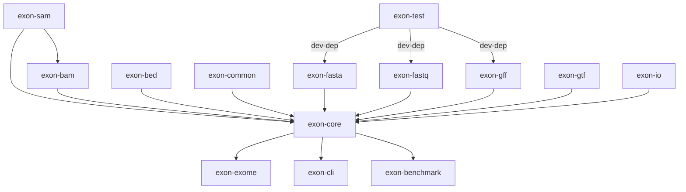

# How to Release `Exon`

Exon is a packaged in multiple crates as part of a larger workspace. The dependency graph looks like:



Therefore, to release the packages you must first release the undepended crates, then the depended crates.

## Release Steps

First, bump the version in `Cargo.toml`, and bump the version of and inter-crate dependencies.

Commit the changes,

```console
git commit -m 'release: bump version to v0.1.0'
```

and tag the commit with the version number.

```console
git tag -a v0.1.0 -m "Release v0.1.0"
```

Then publish the crates:

```console
# Crates that do not depend on other crates
cargo publish --manifest-path exon/exon-bam/Cargo.toml
cargo publish --manifest-path exon/exon-bed/Cargo.toml
cargo publish --manifest-path exon/exon-common/Cargo.toml
cargo publish --manifest-path exon/exon-fasta/Cargo.toml
cargo publish --manifest-path exon/exon-fastq/Cargo.toml
cargo publish --manifest-path exon/exon-gff/Cargo.toml
cargo publish --manifest-path exon/exon-gtf/Cargo.toml
cargo publish --manifest-path exon/exon-io/Cargo.toml

# Crates that depend on other crates
cargo publish --manifest-path exon/exon-core/Cargo.toml
cargo publish --manifest-path exon/exon-exome/Cargo.toml
```
