# VCF

- [File Detection](#file-detection)
- [VCF Expression Rewriting](#vcf-expression-rewriting)
- [Rules](#rules)
  - [(A) Binary Expression with Chrom Column and Literal](#a-binary-expression-with-chrom-column-and-literal)
  - [(B) Binary Expression with Pos Column and Literal (Equals)](#b-binary-expression-with-pos-column-and-literal-equals)
  - [(C) Binary Expression with Pos Column and Literal (Less Than Equal)](#c-binary-expression-with-pos-column-and-literal-less-than-equal)
  - [(D) Binary Expression with Pos Column and Literal (Greater Than Equal)](#d-binary-expression-with-pos-column-and-literal-greater-than-equal)
  - [(E) Binary Expression with IntervalPhysicalExpr and ChromPhysicalExpr (And)](#e-binary-expression-with-intervalphysicalexpr-and-chromphysicalexpr-and)
  - [(I) Binary Expression with IntervalPhysicalExpr and IntervalPhysicalExpr (And)](#i-binary-expression-with-intervalphysicalexpr-and-intervalphysicalexpr-and)
  - [(J) Binary Expression with a RegionPhysicalExpr and a IntervalPhysicalExpr](#j-binary-expression-with-a-regionphysicalexpr-and-a-intervalphysicalexpr)
  - [(K) Binary Expression with a two RegionPhysicalExpr expressions (And)](#k-binary-expression-with-a-two-regionphysicalexpr-expressions-and)
- [Example](#example)
- [Combining Chrom, Interval, and Region](#combining-chrom-interval-and-region)
  - [Chrom](#chrom)
  - [Interval](#interval)
  - [Region](#region)

## File Detection

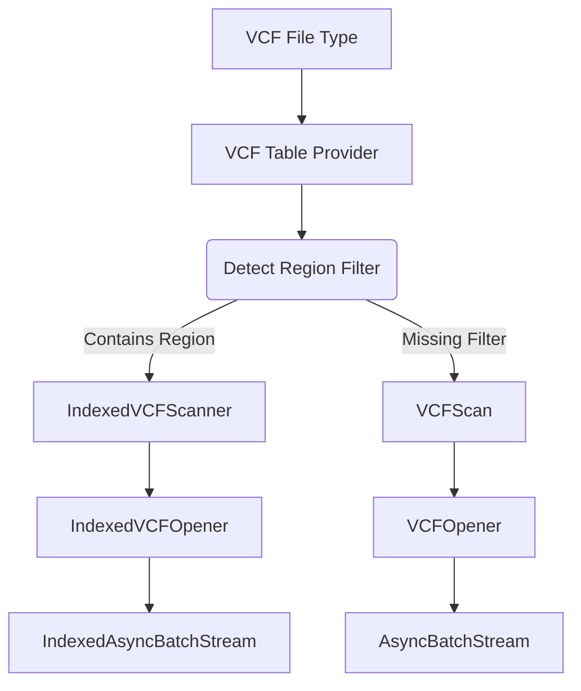

## VCF Expression Rewriting

Documents the VCF expression rewriting process and rules.

## Rules

### (A) Binary Expression with Chrom Column and Literal

When there's an equals binary expression with a chrom column and a literal, rewrite the expression to a ChromPhysicalExpr.

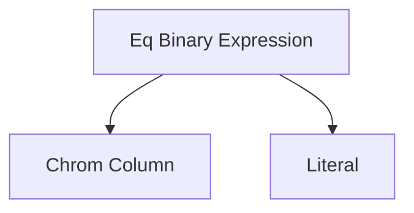

Becomes the following with a region of the literal.


### (B) Binary Expression with Pos Column and Literal (Equals)

When there's an equals binary expression with a pos column and a literal, rewrite the expression to a Interval.

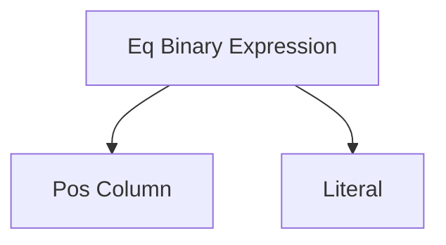

Becomes the following with an interval of the literal. E.g. if the literal is `5` the VCF interval will be `5-5`.


### (C) Binary Expression with Pos Column and Literal (Less Than Equal)

When there's a less than binary expression with a pos column and a literal, rewrite the expression to a Interval.

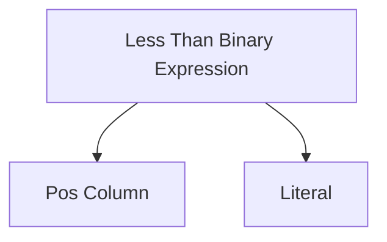

Becomes the following with an interval of the literal. E.g. if the literal is `5` the VCF interval will be `1-5`.


Note: we won't support strict less than because it doesn't match the inclusive nature of VCF intervals.

### (D) Binary Expression with Pos Column and Literal (Greater Than Equal)

When there's a greater than binary expression with a pos column and a literal, rewrite the expression to a Interval.

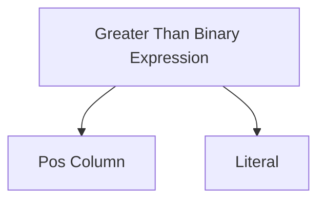

Becomes the following with an interval of the literal. E.g. if the literal is `5` the VCF interval will be `5-`.


Note: this must be paired with a less than equal expression to be valid. If there's no less than equal expression, the interval is unbounded. But we don't know that initially, so we'll just assume it's bounded.

### (E) Binary Expression with IntervalPhysicalExpr and ChromPhysicalExpr (And)

When there's a binary expression with an interval physical expression and a chrom physical expression, rewrite the expression to a RegionPhysicalExpr.

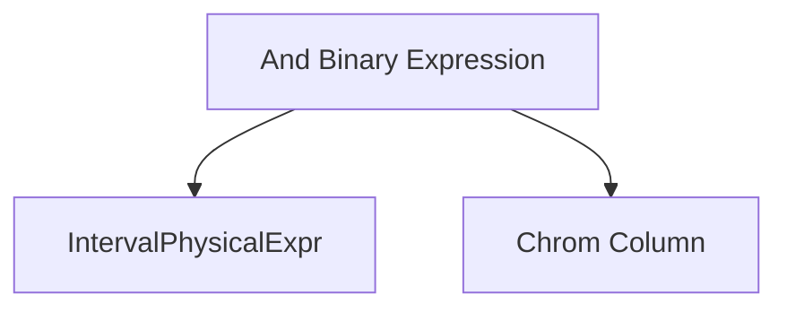

Becomes the following:


### (I) Binary Expression with IntervalPhysicalExpr and IntervalPhysicalExpr (And)

When there's a binary expression with two interval physical expressions, rewrite the expression to a new `IntervalPhysicalExpr` with the intersection of the two intervals.

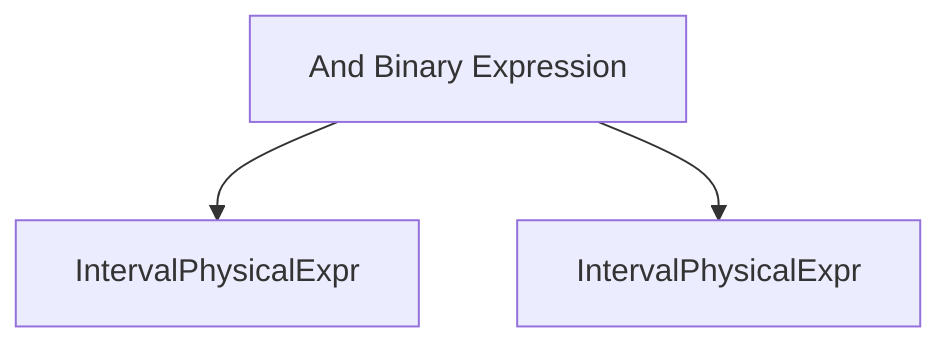

Becomes the following:


### (J) Binary Expression with a RegionPhysicalExpr and a IntervalPhysicalExpr

When there's a binary expression with a region expression and an interval expression, the region's chrom stays the same, but the interval is updated to the intersection of the two intervals.

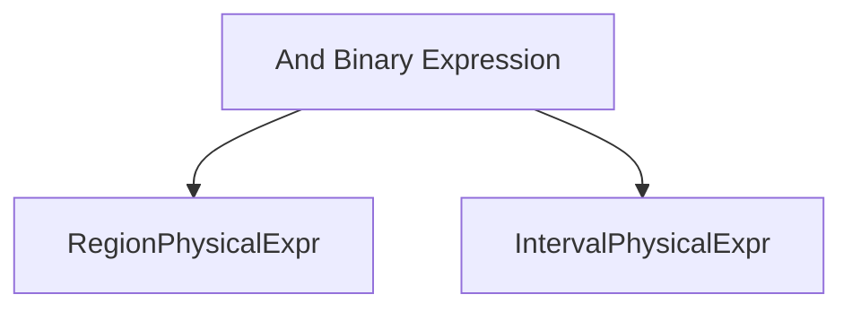

Becomes the following:


### (K) Binary Expression with a two RegionPhysicalExpr expressions (And)

When there's a binary expression with two region expressions:

- The chrom is used if they remain the same, otherwise the expression is guaranteed to be false.
- The interval is updated to the intersection of the two intervals.

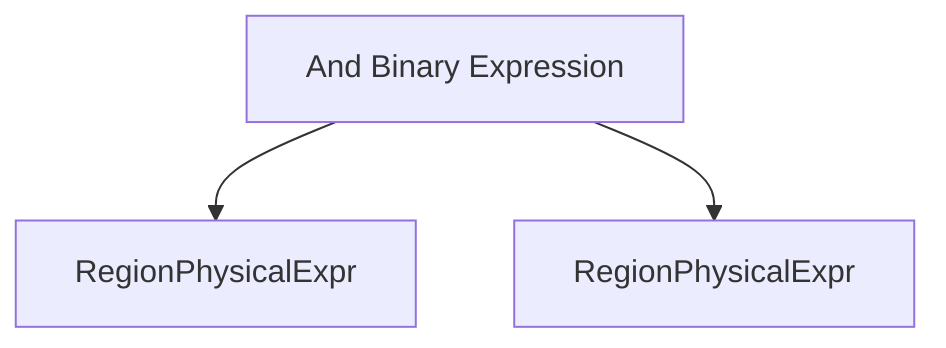

Becomes the following:


## Example

This example shows how a binary expression that's the same as `chrom = 'chr1' AND pos BETWEEN 0 AND 1` is rewritten.

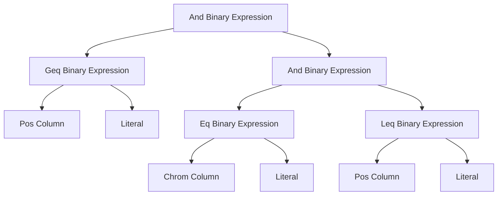

Using a `transform_up` approach we start with the leafs and rewrite them to the following:

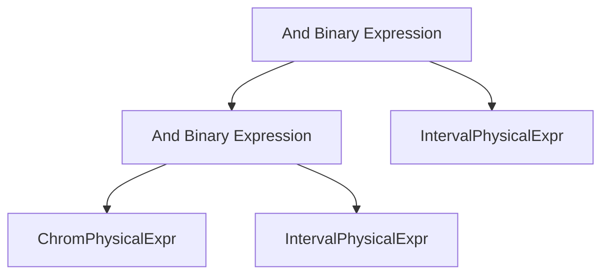

Then we rewrite bottommost `And Binary Expression` to a `RegionPhysicalExpr`:


And finally we can combine the `RegionPhysicalExpr` and `IntervalPhysicalExpr` to a `RegionPhysicalExpr`:

```mermaid
flowchart TB
    Z[RegionPhysicalExpr]
```

## Combining Chrom, Interval, and Region

The following rules are used to combine chrom, interval, and region expressions.

### Chrom

Chrom's are combined using the following rules:

- If the chroms are the same, the chrom is the same.
- If the chroms are different, this must be false.

### Interval

Intervals have a lower and upper bound, with both being inclusive. The interval will always have a lower bound (can default to 1), but the upper bound of the eventual interval may not be known. The interval is represented as:

```rust
struct Interval {
    lower_bound: u32, // will be 1 if not known
    upper_bound: Option<u32>,
}
```

The rules for combining intervals are:

- If the intervals are the same, the interval is the same.
- If both intervals are unbounded, the lower bound is the max of the lower bounds, and the upper bound remains unbounded.
- If one of the intervals is unbounded, the upper bound is the upper bound of the other interval, and the lower bound is the max of the lower bounds.
- If both intervals are bounded, this is the intersection of the two intervals. If the intersection is empty, this is false.

### Region

Regions are a combination of a chrom and an interval. The rules for combining regions are:

These are combined using the rules for combining chroms and intervals.
