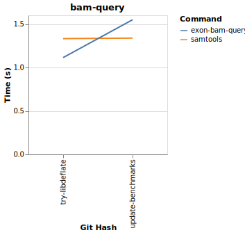
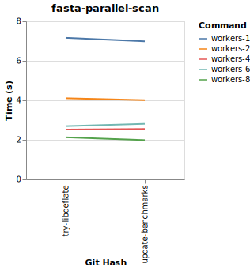

# Exon Benchmarks

This page describes the benchmarks for Exon.

## UniProt Non-Methionine Amino Acid Counts

This benchmarks shows the performance of counting the number of amino acids from uniprot that do not start with methionine.

UniProt has about 560k sequences.

## VCF Query

This benchmark shows querying a 2.6G VCF file for a genomic region.

## BAM Query

This benchmark shows querying a 303M BAM file for a genomic region.

## MzML Scan

This benchmark shows scanning an MzML file with roughly 6k spectra.

## Per-File Parallel FASTA Scan

This benchmark shows scanning 8 FASTA files at different levels of parallelism.

