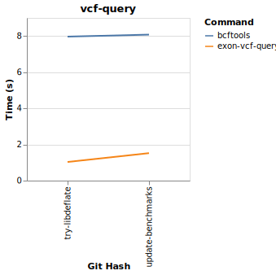

# Exon Benchmarks

This page describes the benchmarks for Exon.

Please note, some benchmarks aren't apples to apples. For example, counting the results of a VCF query through `bcftools` will not generate an otherwise useful data structure (Arrow RecordBatch) outside of the task at hand and thus speed differences should be considered in that context.

## UniProt Non-Methionine Amino Acid Counts

This benchmarks shows the performance of counting the number of amino acids from uniprot that do not start with methionine.

UniProt has about 560k sequences.

## VCF Query

This benchmark shows querying a 2.6G VCF file for a genomic region. A reminder that Exon is parsing the VCF file and its fields into a RecordBatch with Schema for Info and Format fields.

## BAM Query

This benchmark shows querying a 303M BAM file for a genomic region. The same caveat as the VCF query benchmark applies.

## MzML Scan

This benchmark shows scanning an MzML file with roughly 6k spectra.

