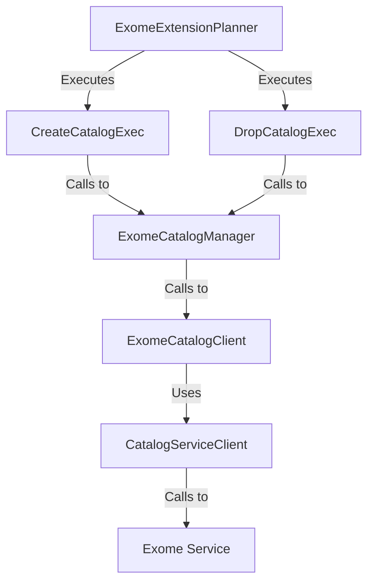

[`ExonClient`][ExonClient] is a trait that can be used to manage an exon catalogs.

[`ExomeSession`][ExomeSession] is a struct that represents a session of a remote instance of the Exome Service.

[`ExomeCatalogClient`][ExomeCatalogManager]

[`ExomeCatalogManager`][ExomeCatalogManager]: exists within the DataFusion SQL context, called within the particular Execution Plan's `execute` method. This is the `Extension`.

`CatalogServiceClient` is the proto service

# SQL Planning

[`ExomeExtensionPlanner`][ExomeExtensionPlanner] -- extends `ExtensionPlanner`, which is the DataFusion struct.

## Execution Plans

These are delegated to within the `ExomeExtensionPlanner` struct.

`CreateCatalogExec` -- creates a catalog.

